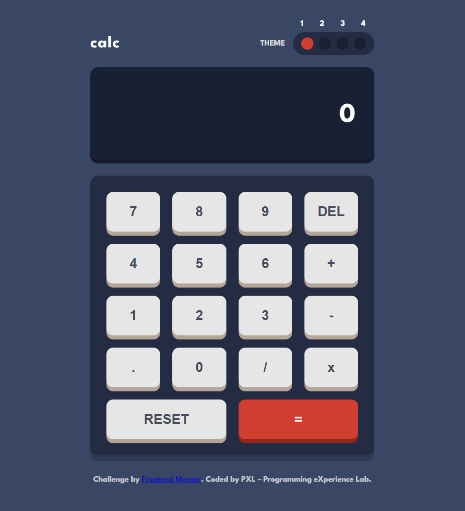

# Frontend Mentor - Calculator app solution

This is my solution to the [Calculator app challenge](https://www.frontendmentor.io/challenges/calculator-app-9lteq5N29) on Frontend Mentor.  
Frontend Mentor challenges help improve coding skills by building realistic projects.

## 📸 Preview

## 🔗 Links

- Solution URL: [GitHub Repository] - https://github.com/ProgrammingeXperienceLab/calculator-app
- Live Site URL: [Live Demo] - https://calculator-appx.netlify.app

## 🛠️ Built with

- Semantic **HTML5** markup  
- **CSS3** custom properties for theming  
- **Vanilla JavaScript** (no frameworks)  
- **Flexbox** & **CSS Grid** for layout  
- Mobile-first responsive design  

## ✨ Features

- Fully functional calculator: add, subtract, multiply, divide  
- Keyboard support for quick input  
- Error handling & input validation  
- Responsive design (works on all screen sizes)  
- Theme switching with **4 color themes**  
- Theme preference saved in **localStorage**  
- Bonus: respects system preference via `prefers-color-scheme`

## 🚀 Deployment

This project is deployed with:

https://github.com/ProgrammingeXperienceLab/calculator-app 
https://calculator-appx.netlify.app

## 📚 What I learned

- How to manage state for calculators with JavaScript  
- Handling keyboard events alongside button clicks  
- Implementing a theme system with CSS variables and localStorage  
- Using `prefers-color-scheme` to detect the system’s default theme  

## 📦 Useful resources

- [MDN Web Docs](https://developer.mozilla.org/) – invaluable reference  
- [CSS Variables Guide](https://css-tricks.com/css-variables-guide/)  
- [JavaScript Keyboard Events](https://developer.mozilla.org/en-US/docs/Web/API/KeyboardEvent)  

## 👤 Author

- Frontend Mentor – [@ProgrammingeXperienceLab ] - https://www.frontendmentor.io/profile/ProgrammingeXperienceLab
- GitHub – [@ProgrammingeXperienceLab ]  - https://github.com/ProgrammingeXperienceLab 

---

**Have fun coding! 🚀**
